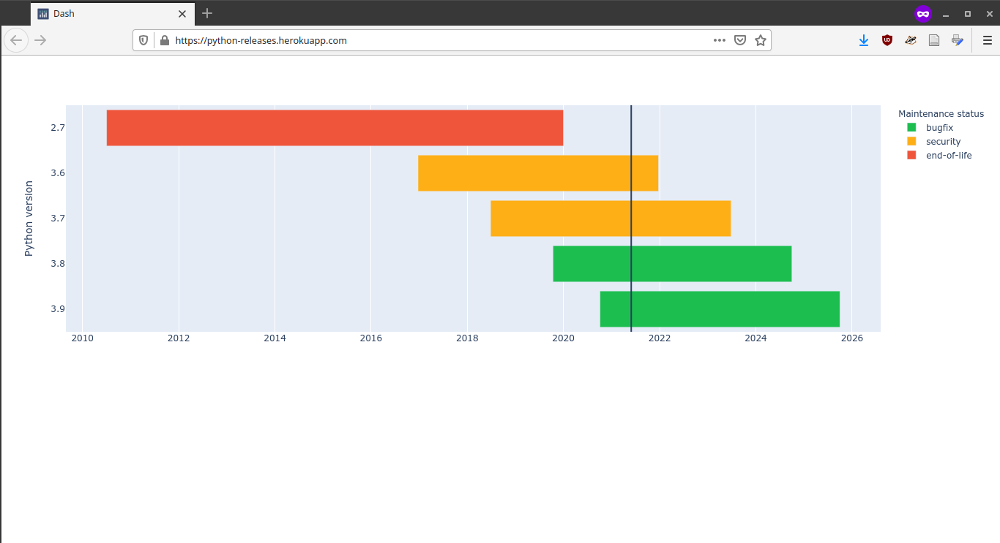

[](https://github.com/psf/black)
[](https://github.com/pre-commit/pre-commit)


# Description
Visualization of python releases using [heroku](https://python-releases.herokuapp.com/).




## Instructions (Development)
Create a virtual environment and install the required packages with
```
python3 -m venv .venv
source .venv/bin/activate
python -m pip install --upgrade pip
pip install wheel
pip install -r requirements-dev.txt
pre-commit install
```


### Tests
To execute tests, type
```
python -m unittest discover
```


### Deployment
The code is deployed automatically with [github integrations](https://devcenter.heroku.com/articles/github-integration)
option enabled in Heroku.
